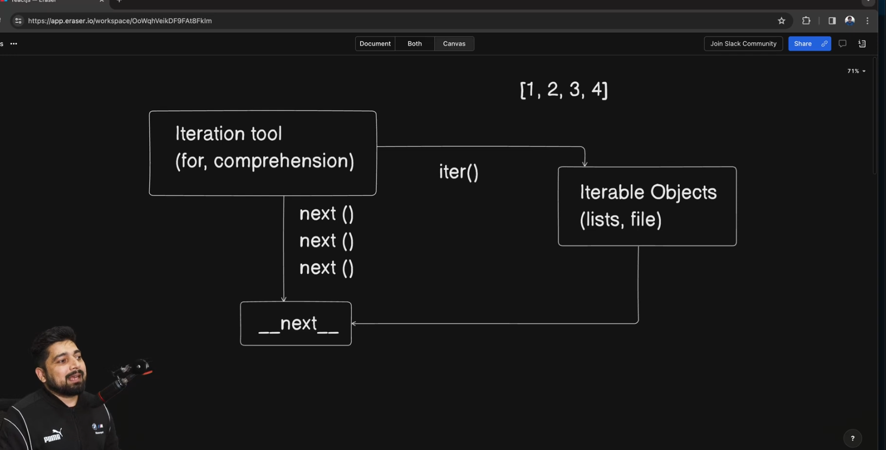

# Behind the Scene: How Loops Work

When we iterate over an array (or list), Python sends the **next value** one by one.



Example:

```python
arr = [10, 20, 30, 40]

for num in arr:
    print(num)  # next value each time 
# it that the exception is resise then value is not be move forward